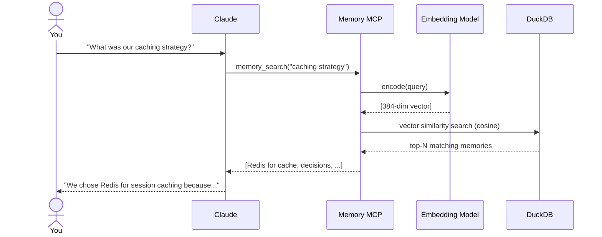
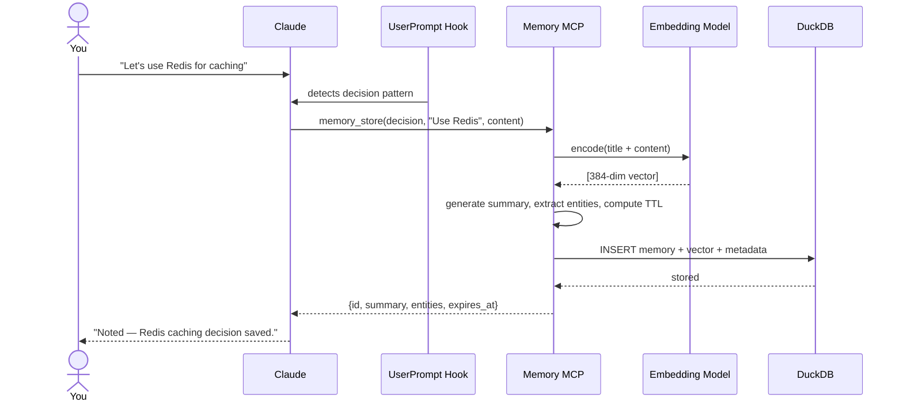
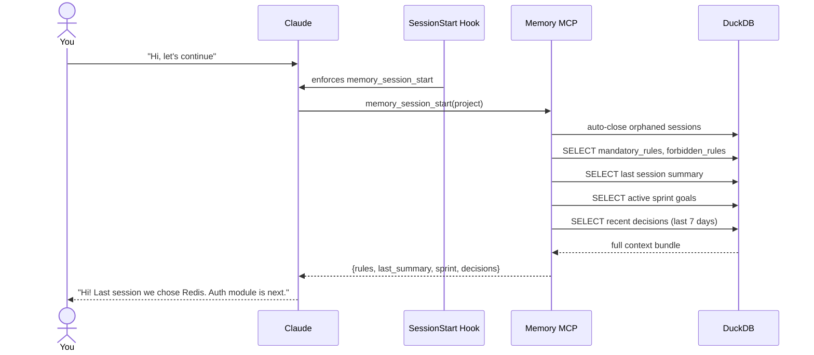
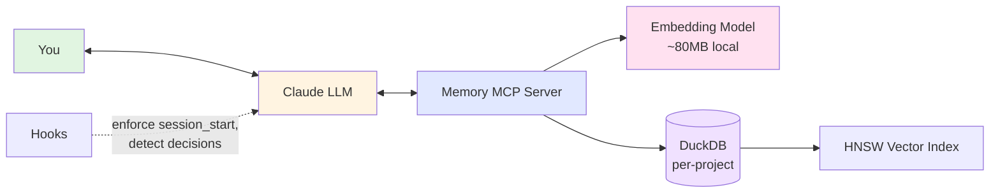

# SMG Claude Memory MCP

**Persistent, searchable project memory for Claude Code.** Each project has its own brain — decisions, rules, architecture notes, sprint goals — all stored locally in a vector database and automatically loaded every time you start a new session.

> **What problem does this solve?** Claude forgets everything between sessions. You end up re-explaining the same things over and over, rules get missed, past decisions get lost when your context window fills up, and switching machines means starting from scratch. This MCP gives Claude a real memory — one that survives restarts, context overflows, and team handoffs.

---

## In Plain English

### What does this project actually do?

**It gives Claude permanent memory per project.** Think of it as a separate brain for each of your projects.

When you're working on something, you make decisions ("we chose PostgreSQL"), set rules ("always run tests before commits"), and plan sprints. Normally, all of that is **forgotten when a new session starts**, or gets scattered across `.md` files that Claude has to re-read every time.

With this MCP:
- **When you make a decision** → Claude stores it automatically
- **When you ask about something** → Claude searches memory first, then answers
- **When you start a new session** → All the important stuff loads automatically
- **When you set a rule** ("always do X") → Claude won't forget it again

### Three things users should understand

1. **Semantic search** — Ask "what database did we pick?" and it finds the PostgreSQL decision, even if you never typed "PostgreSQL" in your query. It searches by meaning, not keywords.

2. **Project isolation** — Every project has its own separate memory database. Memories from `project-A` never leak into `project-B`.

3. **Team collaboration** — You can move a project's memory into the project folder, commit it to git, and your teammates get the same memory after `git pull`.

### The technical one-liner

> "An MCP server for Claude Code that stores per-project memory in local DuckDB with vector embeddings. It remembers decisions, rules, and sprint notes, retrieves them via semantic search, and auto-loads full context at session start — so Claude never forgets anything."

### What you'll feel day-to-day

- You won't need to re-explain your project's decisions every session
- Rules you've set stick — Claude can't skip them (enforced by hooks)
- Context window overflows don't lose important info (it's in the DB)
- Switching machines? `git pull` + one command, and Claude picks up exactly where you left off
- Onboarding a teammate's Claude? Same thing — they get your whole project memory instantly

---

## FAQ — Common Questions, Clear Answers

### Q: When I run `make_portable`, does it move ALL projects' memory to git, or just the one I'm working on?

**Just the one project. Other projects are never touched.**

Each project has its own separate `.duckdb` file:

```
~/.memory-mcp/
├── registry.duckdb              ← List of projects (name + path)
└── projects/
    ├── my-app.duckdb            ← ONLY my-app's memory
    ├── smg-analytics.duckdb     ← ONLY smg-analytics's memory
    └── other-project.duckdb     ← ONLY other-project's memory
```

When you run:

```
/smg-memory portable /Users/you/projects/smg-analytics
```

What happens:
1. Copies `~/.memory-mcp/projects/smg-analytics.duckdb` → `/Users/you/projects/smg-analytics/.memory-mcp.duckdb`
2. Moves the original to `~/.memory-mcp/backups/` (kept as safety net)
3. Updates the registry so this project now uses the new location

The other projects stay right where they are. Their memory is never exposed in this repo's git history.

When you `git add .memory-mcp.duckdb` and push, you're only sharing **that specific project's** memory. Teammates who pull it only get that project's memory — not a window into all your other work.

### Q: Will my memories from one project contaminate another project?

**No.** Strict isolation. Each project's `.duckdb` is its own DuckDB database. Searches, rules, sessions — everything is scoped to one project at a time.

### Q: What happens if my context window fills up mid-session?

You won't lose anything. Memories live in the DB, not in the context window. When you start a new session, `memory_session_start` auto-loads:
- All mandatory rules (guaranteed, cached, never approximated)
- All forbidden rules
- Last session's summary
- Active sprint goals
- Recent decisions (last 7 days)

Anything older is one semantic search away.

### Q: Do I need to manually store every memory?

**No.** When a session is active, Claude auto-stores:
- Decisions you make ("we decided to use X", "going with Y")
- Rules you set ("always do X", "never do Y")
- Feedback ("don't do that again", "keep doing that")
- Architecture choices

You can also explicitly use `/smg-memory store <category> <title> <content>` when you want control.

### Q: Does anything leave my machine?

**No.** Everything is local:
- DuckDB database on your disk
- Embeddings generated locally by `sentence-transformers` (CPU, no GPU needed)
- No API keys, no cloud services, no telemetry

The only network call is the one-time ~80MB download of the embedding model from Hugging Face.

### Q: Can my teammate who doesn't have this MCP still read the memories?

**Yes.** Run `/smg-memory export <project-path>` and it creates a `.memory/` directory with human-readable Markdown files. Anyone can read, edit, or review them directly. You can sync changes back with `/smg-memory import`.

---

## How It Works — The Flow

Three interaction patterns. In all of them, **you talk to Claude normally** — the MCP works behind the scenes.

### The Cast

Before the flows, a quick clarification — these are **different things**:

| Component | What it is | What it does |
|-----------|-----------|--------------|
| **Claude** (LLM) | Large language model | Understands you, makes decisions, writes answers |
| **Memory MCP** | This server | Orchestrates storage and retrieval |
| **Embedding model** (all-MiniLM) | Small neural net (~80MB) | Turns text into 384 numbers (a vector). Does NOT understand anything |
| **DuckDB** | Local database | Stores memories + vectors, does similarity math |

The embedding model is NOT an LLM. It doesn't "understand" — it just converts text to numbers so that similar meanings produce similar vectors. That's why it's small and fast.

---

### Flow 1: You ask a question

> "What was our caching strategy?"



**What happened**: Claude triggered a vector search. The query became a vector. DuckDB found memories with similar vectors (same meaning). Claude composed the answer from those memories.

---

### Flow 2: You make a decision

> "Let's use Redis for caching."



**What happened**: The UserPromptSubmit hook noticed a decision pattern. Claude auto-stored it. MCP generated a summary, extracted entities (like "Redis"), computed a TTL (365 days for decisions), and wrote everything to DuckDB along with the vector.

---

### Flow 3: You start a new conversation

> "Hi, let's continue."



**What happened**: The hook forced Claude to call `memory_session_start`. MCP pulled everything important in one batch — rules, last session summary, active sprint, recent decisions — and Claude started the conversation already knowing the project's state.

---

### High-Level View



Everything runs locally on your machine. No cloud, no API keys, no telemetry.

---

## Multilingual Support

### The Default: English-Only

Out of the box, this MCP uses **`all-MiniLM-L6-v2`** — a small, fast, **English-only** embedding model:

- Size: ~80MB on disk, ~90MB RAM
- Speed: ~14k sentences/sec on CPU
- Languages: English only
- Quality: Excellent for English

**What this means in practice:**

```
✅ "which database did we choose?" → finds the PostgreSQL decision (English content)
❌ "hangi veritabanını seçtik?"    → may return 0 results (Turkish query, English content)
```

If your memories are in English, the default works great. If you or your team write in other languages, you need the multilingual model.

### Switching to Multilingual

If you want to **ask questions** or **store memories** in non-English languages, switch to the multilingual model:

```
/smg-memory model multilingual
```

This will:
1. Show you the impact (disk, RAM, memories to re-embed)
2. Ask for confirmation
3. Download the multilingual model (~470MB, one-time)
4. Re-embed all your existing memories with the new model
5. Persist the choice (survives restarts)

After switching, you can search and store in **any of these 50+ languages**:

| Region | Languages |
|--------|-----------|
| **European** | English, German, French, Spanish, Italian, Portuguese, Dutch, Polish, Swedish, Romanian, Czech, Danish, Finnish, Greek, Hungarian, Norwegian, Bulgarian, Catalan, Galician, Croatian, Slovak, Slovenian, Lithuanian, Latvian, Estonian, Ukrainian, Serbian, Macedonian, Albanian |
| **Middle Eastern** | Arabic, Hebrew, Persian (Farsi), Kurdish, Armenian, Urdu |
| **Asian** | Chinese, Japanese, Korean, Vietnamese, Thai, Indonesian, Malay, Burmese, Mongolian |
| **South Asian** | Hindi, Gujarati, Marathi |
| **Turkic** | **Turkish**, Azerbaijani (partial) |

### Cross-Lingual Superpower

The multilingual model is **cross-lingual** — you can store memories in one language and search in another:

```
Store (English):  "We chose PostgreSQL for JSON support and reliability"
Search (Turkish): "hangi veritabanını kullanıyoruz?" → finds the PostgreSQL decision ✅
Search (Japanese): "どのデータベースを使っていますか?" → finds it too ✅
```

### Comparison

| | English-only (default) | Multilingual |
|---|---|---|
| Model | `all-MiniLM-L6-v2` | `paraphrase-multilingual-MiniLM-L12-v2` |
| Disk | ~80MB | ~470MB |
| RAM | ~90MB | ~500MB |
| Parameters | 22M | 118M |
| Speed | ~14k sent/sec | ~5k sent/sec |
| Languages | English only | 50+ languages |
| Cross-lingual | No | **Yes** |
| Vector dimensions | 384 | 384 (same) |

### Switching Back

Want to go back to English-only?

```
/smg-memory model english
```

Same two-step confirmation, re-embeds all memories back.

### Check Current Model

```
/smg-memory model
```

Shows which model is active and presents both options with their trade-offs.

---

## Why Not Just Use `MEMORY.md`?

Claude Code's built-in memory has real limitations:

| Problem | `MEMORY.md` | This MCP |
|---------|-------------|----------|
| Semantic search | ❌ Keyword only | ✅ Vector-based, finds by meaning |
| Context window cost | ❌ Eats your context | ✅ Stored in DB, fetched on demand |
| Project isolation | ❌ Mixes across projects | ✅ One DB per project |
| Rules enforcement | ❌ May get skipped | ✅ Hook-enforced, always loaded |
| Team sharing | ❌ Local only | ✅ Git-portable |
| Multi-language | ❌ Varies | ✅ 50+ languages (optional model) |
| Audit trail | ❌ None | ✅ Full provenance tracking |

---

## Features

| Feature | Description |
|---------|-------------|
| **Semantic Search** | HNSW-accelerated cosine similarity — find memories by meaning |
| **Per-Project Isolation** | Each project gets its own DuckDB database |
| **11 Memory Categories** | decisions, sessions, sprints, architecture, rules, devops, and more |
| **Rules Enforcement** | Mandatory/forbidden rules, cached, never approximated |
| **Session Management** | Auto-loads full context (rules, sprint, recent decisions) at session start |
| **Auto-Summary** | 15-20 word summary generated for every memory |
| **Entity Extraction** | Automatic detection of tech names, @mentions, #tags, acronyms |
| **TTL/Expiration** | Category-based auto-expiration (rules never expire) |
| **Provenance Tracking** | Full audit trail for every memory operation |
| **Token Budgeting** | Dual-phase search responses — lightweight index + full details |
| **Portable DB** | Move DB into project directory, share via git |
| **Export/Import** | Human-readable `.md` export for non-MCP users |
| **Active Project** | Set once, use everywhere — no need to repeat project slug |
| **CWD Detection** | Auto-detects project from current working directory |
| **Switchable Models** | English-only (fast, 80MB) or multilingual (50+ langs, 470MB) |
| **Zero Cloud Deps** | No API keys, no cloud services, fully local |

---

## Quick Install

```bash
git clone https://github.com/serkansmg/smg-claude-memory-mcp.git
cd smg-claude-memory-mcp
chmod +x install.sh
./install.sh
```

This will:
1. Install `uv` if not present
2. Install all Python dependencies in an isolated venv (no system pollution)
3. Download the embedding model (~80MB, one-time)
4. Configure Claude Code MCP automatically

Then restart Claude Code.

### Manual Install

```bash
uv sync
uv run memory-mcp-setup
```

Or add to Claude Code manually (`.mcp.json` or `~/.claude.json`):

```json
{
  "mcpServers": {
    "memory": {
      "command": "uv",
      "args": ["run", "--directory", "/path/to/smg-claude-memory-mcp", "memory-mcp"]
    }
  }
}
```

---

## Quick Start

```
# 1. Create a project (one-time)
/smg-memory init my-app "My Application"

# 2. Start a session (beginning of each conversation)
/smg-memory start

# 3. Store memories (or let Claude auto-detect from conversation)
/smg-memory store decision "Use PostgreSQL" "Chose PostgreSQL for JSON support"
/smg-memory store mandatory_rules "Always Test" "Run pytest before every commit"

# 4. Search
/smg-memory search "database choice"

# 5. End session
/smg-memory end "Implemented auth module, chose JWT tokens"
```

---

## Usage

### Project Management

```bash
# Create new project (auto-activates)
/smg-memory init my-app "My Application"

# Attach existing project directory
/smg-memory attach /path/to/my-app

# Set active project (no need to pass project= to every command)
/smg-memory use my-app

# List all projects
/smg-memory projects
```

### Session Lifecycle

```bash
# Start session — loads rules, last session summary, sprint goals, recent decisions
/smg-memory start

# End session with summary
/smg-memory end "Completed user auth, decided on JWT, next: API rate limiting"
```

### Memory Operations

```bash
# Store (project is optional — uses active project)
/smg-memory store decision "Redis for Cache" "Using Redis for session and API caching"
/smg-memory store architecture "Event-Driven" "Adopted event-driven architecture with RabbitMQ"
/smg-memory store mandatory_rules "PR Reviews" "All PRs require at least one review"

# Semantic search
/smg-memory search "caching strategy"
/smg-memory search "deployment pipeline"

# List by category
/smg-memory list decisions
/smg-memory list mandatory_rules

# Get rules
/smg-memory rules

# View change history
/smg-memory history <memory-id>
```

### Team Collaboration

#### Option A: Share via Git (portable DB)

```bash
# Developer 1: Move DB to project directory
/smg-memory portable /path/to/project
# Add to .gitignore: *.duckdb.wal
git add .memory-mcp.duckdb
git commit -m "add project memory"
git push

# Developer 2: After git pull
/smg-memory sync /path/to/project
# Ready! All memories from Developer 1 are available.
```

#### Option B: Export for non-MCP users

```bash
# Export to human-readable .md files
/smg-memory export /path/to/project

# Creates:
# .memory/
#   MEMORY_INDEX.md          <- Master index
#   README.md                <- Format docs
#   decision/
#     use-postgresql.md      <- Individual memories
#   mandatory_rules/
#     always-test.md
#   architecture/
#     event-driven.md

# Non-MCP users can read and edit these files directly.

# Import changes back
/smg-memory import /path/to/project
```

### Automatic Memory (No Commands Needed)

When a session is active, Claude automatically:
- **Stores decisions** when you make architectural or technical choices
- **Stores rules** when you say "always do X" or "never do Y"
- **Searches memory** when you ask about past decisions
- **Checks rules** before significant operations

---

## Memory Categories

| Category | Description | TTL |
|----------|-------------|-----|
| `decision` | Important decisions and rationale | 365 days |
| `session` | Session summaries | 30 days |
| `sprint` | Sprint goals, progress, retrospectives | 90 days |
| `project_plan` | Project plans and milestones | 365 days |
| `architecture` | Architecture decisions and patterns | 365 days |
| `devops` | DevOps configs, deployment notes | 180 days |
| `mandatory_rules` | Rules that MUST be followed | **Never expires** |
| `forbidden_rules` | Operations that are FORBIDDEN | **Never expires** |
| `developer_docs` | Developer documentation | 180 days |
| `feedback` | User feedback on assistant behavior | 90 days |
| `reference` | Pointers to external resources | 365 days |

---

## MCP Tools Reference

| Tool | Description |
|------|-------------|
| `memory_use` | Set active project (no more repeating slug) |
| `memory_init_project` | Create new project namespace |
| `memory_attach_project` | Attach existing project directory |
| `memory_store` | Store memory with auto-embedding, summary, entities, TTL |
| `memory_search` | Semantic search with relevance scoring + token budgeting |
| `memory_recall` | Get memory by ID or exact title |
| `memory_update` | Partial update (re-embeds if content changes) |
| `memory_delete` | Soft or hard delete with provenance |
| `memory_list` | Filtered listing with pagination |
| `memory_provenance` | Full audit trail for a memory |
| `memory_get_rules` | Get all rules (cached, direct SQL) |
| `memory_session_start` | Start session, load full context |
| `memory_session_end` | End session, store summary |
| `memory_make_portable` | Move DB to project dir for git sharing |
| `memory_sync` | Register portable DB after git pull |
| `memory_export` | Export to .md files for non-MCP users |
| `memory_import` | Import from .md files |
| `memory_list_projects` | List all projects |
| `memory_project_info` | Get project details |
| `memory_model_info` | Current embedding model + available presets |
| `memory_set_model` | Switch between english and multilingual models |
| `memory_reembed` | Re-embed all memories with current model |
| `memory_version` | Server version + configuration |

---

## Architecture

```
~/.memory-mcp/
  registry.duckdb              # Project registry (list of all projects)
  projects/
    my-app.duckdb              # Per-project vector DB (ONLY my-app's memory)
    api-backend.duckdb         # Per-project vector DB (ONLY api-backend's memory)
  backups/                     # Automatic backups before destructive operations

# Or portable (DB lives in the project dir, shared via git):
my-app/
  .memory-mcp.duckdb           # This project's memory (in git)
  .memory/                     # Optional: human-readable .md export
```

**Internal architecture (for contributors):**

```
┌───────────────────────────────────────────────┐
│  server.py — FastMCP tool bindings (thin)     │
├───────────────────────────────────────────────┤
│  services/ — business logic                   │
│    MemoryService, SearchService, SessionService,
│    RulesService, ProjectService, PortableService,
│    ExportImportService, ModelService          │
├───────────────────────────────────────────────┤
│  repositories/ — SQL, centralized             │
│    MemoryRepository, ProjectRepository,       │
│    SessionRepository, ProvenanceRepository    │
├───────────────────────────────────────────────┤
│  db/ — connection, schema                     │
└───────────────────────────────────────────────┘
```

**Stack**: FastMCP + DuckDB (VSS/HNSW) + sentence-transformers + Pydantic v2

---

## Requirements

- Python 3.11+
- macOS or Linux (Apple Silicon fully supported)
- ~80MB disk for the English embedding model (~470MB for multilingual)
- ~90MB RAM for the English model loaded (~500MB for multilingual)

---

## Development

```bash
uv sync --all-extras
uv run pytest -v
```

Current test coverage: **98 tests** — 34 repository unit tests, 35 service unit tests, 29 integration tests.

---

## License

MIT
